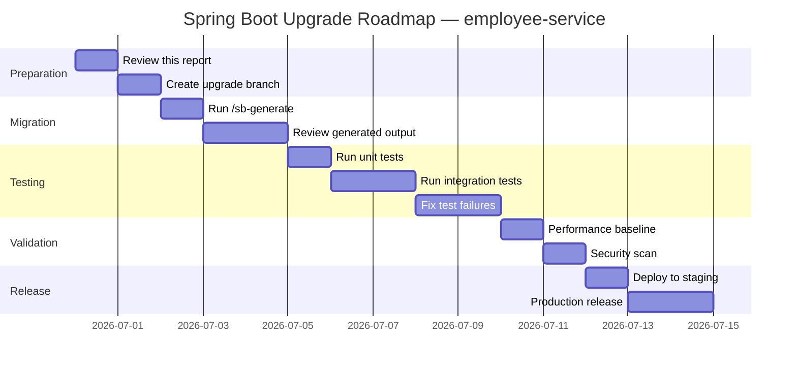
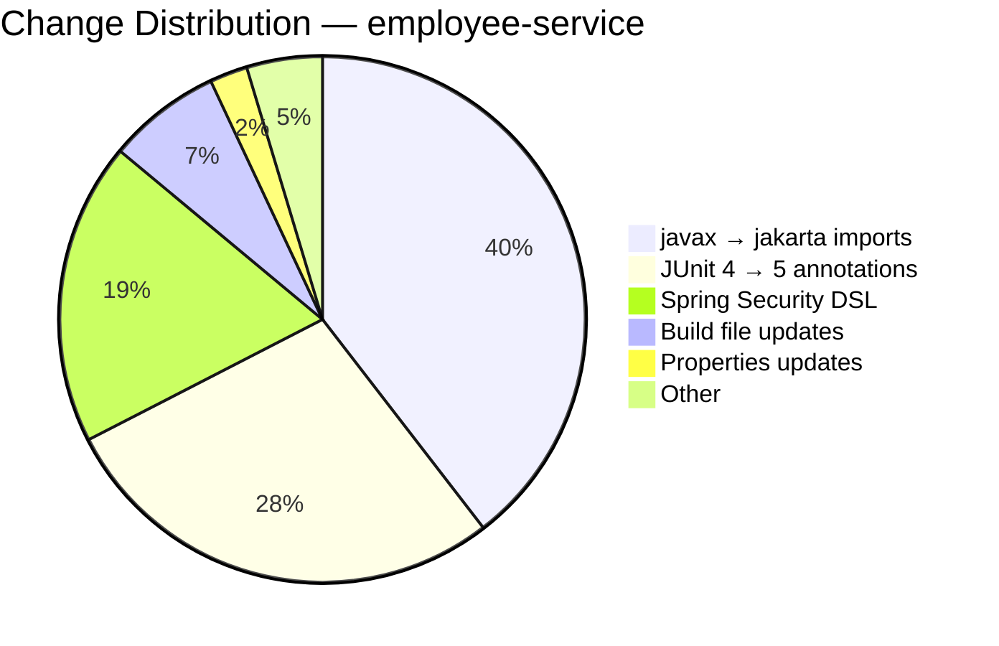
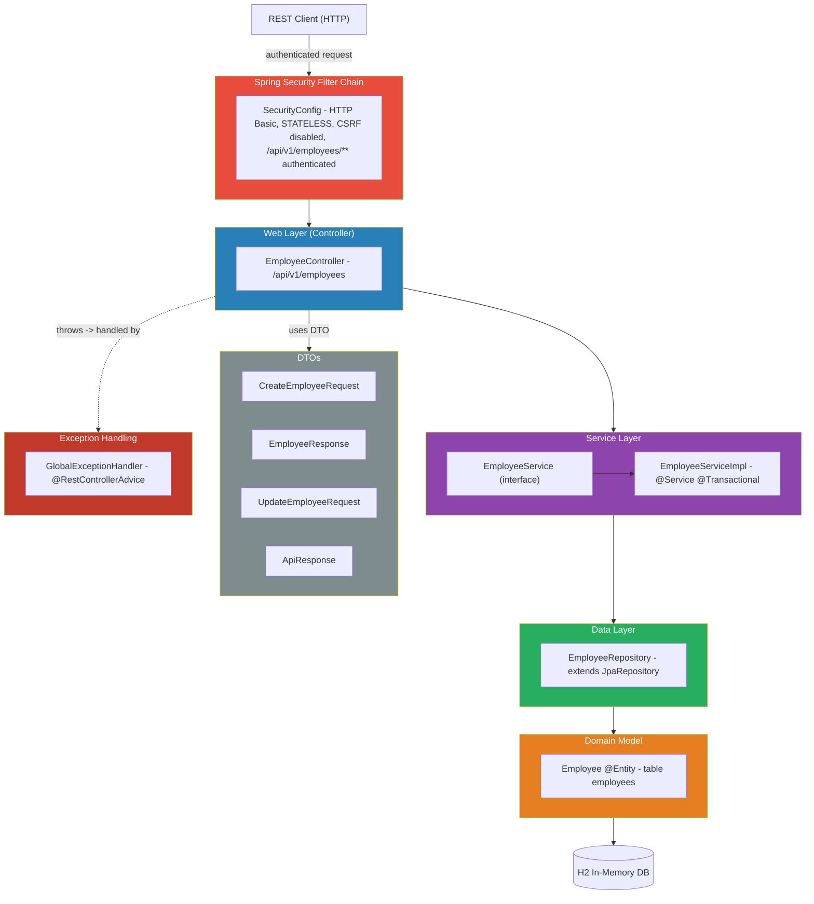
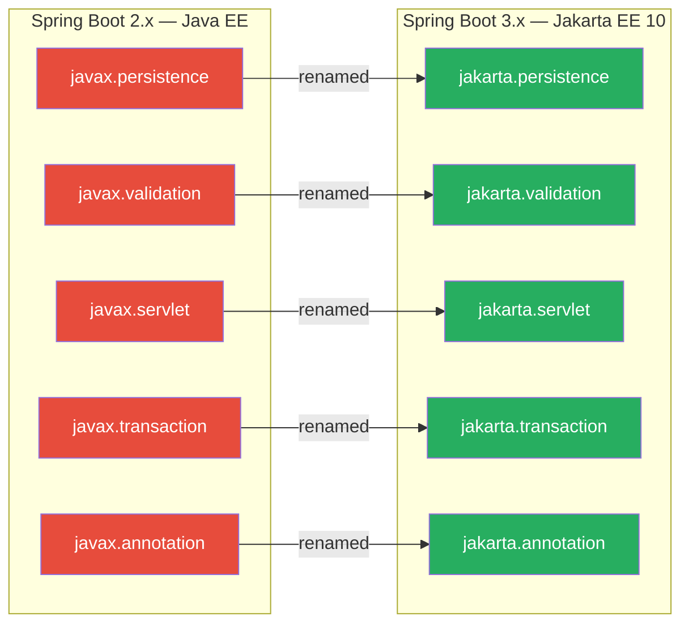
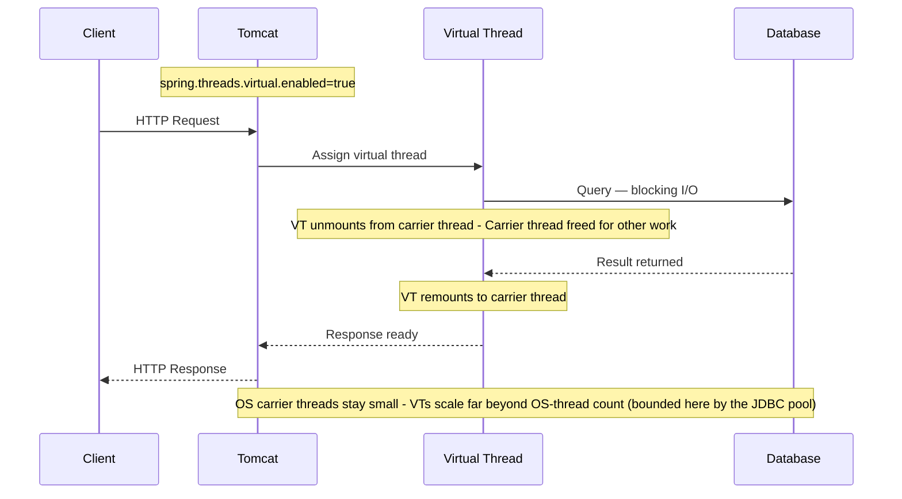

# Spring Boot Upgrade Assessment Report

**Project:** `employee-service`
**Report Date:** `2026-06-30`
**Assessed By:** Spring Boot Upgrade Agent — Java Architect Mode
**Build Tool:** `Maven`

---

## Table of Contents

1. [Executive Summary](#1-executive-summary)
2. [Current State Analysis](#2-current-state-analysis)
3. [Target State](#3-target-state)
4. [Why This Upgrade Is Needed](#4-why-this-upgrade-is-needed)
5. [Benefits](#5-benefits)
6. [Risks and Mitigations](#6-risks-and-mitigations)
7. [Upgrade Roadmap](#7-upgrade-roadmap)
8. [Dependency-Level Changes](#8-dependency-level-changes)
9. [JUnit Migration Changes](#9-junit-migration-changes)
10. [Code Changes Summary](#10-code-changes-summary)
11. [Detailed Proposed Code Changes](#11-detailed-proposed-code-changes)
12. [Architecture Diagrams](#12-architecture-diagrams)
13. [Appendix](#13-appendix)

---

## 1. Executive Summary

| | Current | Target |
|---|---|---|
| Java Version | `11` | `21 (LTS)` |
| Spring Boot | `2.7.18` | `3.5.0` |
| Java EOL Status | `Java 11 — premier support ended Sept 2023; extended/community support only` | Supported to 2030 |
| Spring Boot Support | `2.7.x — OSS support ended Nov 2023; commercial support ending` | Active |

**Upgrade necessity:** Spring Boot 2.7 reached the end of its open-source support life in November 2023 and Java 11's premier support window has closed. Remaining on this stack means no security patches from the upstream projects, growing incompatibility with current libraries (which now ship Jakarta EE 10 baselines), and accumulating technical debt. This is a mandatory modernization for a service that must stay patchable and compliant.

**Estimated effort:** **Low–Medium (~0.5–3 developer-days)**. The codebase is small and well-structured — 15 main source files and 3 test files. The mechanical changes (javax→jakarta across 5 files, JUnit 4→5 across 3 test files, one Security config rewrite, build file bump) are hours of work and largely automatable. The effort range is driven by **how many of three specific regressions actually fire**, not by generic "verification time": (1) Mockito 5 strict-stubs failures in the existing tests, (2) Spring Security 6 default-behavior changes, and (3) Hibernate 6 + H2 2.x SQL/DDL strictness. If the test suite is green after the mechanical changes, the low end (~0.5 day) is realistic; the high end (~3 days) applies only if those regressions surface.

**Key risk:** Two items dominate. (a) The `WebSecurityConfigurerAdapter` → `SecurityFilterChain` rewrite in `SecurityConfig.java`, compounded by Spring Security 6 default changes (DispatcherType.ERROR/FORWARD now filtered, requestMatcher resolution for the non-MVC `/h2-console/**` path). (b) **Mockito 5 strict stubbing** via `MockitoExtension` — the single most likely concrete build break, since `MockitoJUnitRunner` was lenient and the existing tests almost certainly contain stubs not exercised on every path. Both are mitigated by the post-migration test run + API parity probe.

---

## 2. Current State Analysis

### 2.1 Detected Versions

```
Java Version      : 11
Spring Boot       : 2.7.18
Build Tool        : Maven
JUnit             : 4.13.2 (+ junit-vintage-engine bridge)
Source Files      : 15
Test Files        : 3
```

### 2.2 Key Dependencies Detected

| Dependency | Current Version | Action Required |
|---|---|---|
| `org.springframework.boot:spring-boot-starter-parent` | 2.7.18 | Bump to 3.5.0 |
| `org.springframework.boot:spring-boot-starter-web` | (BOM 2.7.18) | Re-managed by 3.5.0 BOM |
| `org.springframework.boot:spring-boot-starter-data-jpa` | (BOM 2.7.18) | Re-managed; `javax.persistence` → `jakarta.persistence` |
| `org.springframework.boot:spring-boot-starter-validation` | (BOM 2.7.18) | Re-managed; `javax.validation` → `jakarta.validation` |
| `org.springframework.boot:spring-boot-starter-security` | (BOM 2.7.18) | Re-managed; `WebSecurityConfigurerAdapter` removed in Security 6 |
| `com.h2database:h2` | (BOM 2.7.18) | Re-managed by 3.5.0 BOM (Hibernate 6 dialect auto-detected) |
| `org.projectlombok:lombok` | (BOM 2.7.18) | Re-managed; compatible (BOM manages a Java 21-ready version) |
| `org.springframework.boot:spring-boot-starter-test` | (BOM 2.7.18) | Re-managed; JUnit 5.11.x |
| `junit:junit` | 4.13.2 | **Remove** — migrate tests to JUnit 5 (Jupiter) |
| `org.junit.vintage:junit-vintage-engine` | (BOM 2.7.18) | **Remove** — no longer needed after JUnit 5 migration |
| `org.mockito:mockito-core` | (BOM 2.7.18) | Re-managed; Mockito 5.x |
| `org.springframework.security:spring-security-test` | (BOM 2.7.18) | Re-managed by 3.5.0 BOM |

### 2.3 End-of-Life Assessment

- **Java 11**: Released Sept 2018. Oracle premier support ended Sept 2023. While LTS distributions (e.g. Eclipse Temurin) still provide updates, the broader ecosystem is moving its baseline to 17/21. Virtual threads and modern language features are unavailable.
- **Spring Boot 2.7.18**: The final 2.7.x patch. OSS support ended **November 2023**. No further free security or bug fixes are published. Spring Boot 2.x depends on Spring Framework 5.x (Java EE / `javax.*`), which is itself end-of-life.
- **JUnit 4.13.2**: Maintenance-only; new assertion/extension features land only in JUnit 5. The pom is in a deliberate transitional state — `spring-boot-starter-test` *excludes* `junit-vintage-engine` (pom.xml:71-76), and the pom then *explicitly re-adds* both `junit:junit:4.13.2` and `org.junit.vintage:junit-vintage-engine` (pom.xml:80-94) so the three JUnit 4 tests are discovered and run on the JUnit 5 Platform. Completing the JUnit 5 migration lets these run natively and removes both extra dependencies.

**Verdict:** The current stack is past its supported life on every major axis. Upgrade is required, not optional.

---

## 3. Target State

| Component | Target | Notes |
|---|---|---|
| Java | 21 LTS | Released Sept 2023, supported to 2030 |
| Spring Boot | 3.5.0 | Current stable target line |
| Spring Framework | 6.2.x | Auto-managed by Spring Boot 3.5 BOM |
| Jakarta EE | 10 | `javax.*` → `jakarta.*` namespace change |
| JUnit | 5.11.x | Auto-managed by Spring Boot 3.5 BOM |
| Mockito | 5.x | Auto-managed by Spring Boot 3.5 BOM |

---

## 4. Why This Upgrade Is Needed

### 4.1 Security
Spring Boot 2.7 stopped receiving open-source security patches in November 2023. Any CVE discovered in Spring Framework 5, Spring Security 5, embedded Tomcat 9, or Hibernate 5 after that date will not be fixed for this branch without a paid commercial support contract. Spring Boot 3.5 sits on Spring Security 6 and Tomcat 10, which are actively patched. For a service that exposes an authenticated REST API, running on an unpatched security stack is the single strongest reason to upgrade now.

### 4.2 Performance
Java 21 brings virtual threads (Project Loom, JEP 444) to general availability. This `employee-service` performs blocking JDBC I/O against its datastore on every request; under Spring Boot 2.7 each concurrent request pins a platform thread for the duration of that I/O. With Spring Boot 3.2+ on Java 21, enabling `spring.threads.virtual.enabled=true` lets Tomcat serve each request on a virtual thread that unmounts from its carrier during blocking calls — raising the concurrency ceiling at a fraction of the memory cost. Java 21 also ships a generational ZGC and years of JIT/G1 improvements over Java 11.

### 4.3 Support and Compliance
Both Java 11 (premier) and Spring Boot 2.7 (OSS) are out of their primary support windows. Many compliance regimes and enterprise security policies require running on actively supported runtimes. Java 21 is supported through at least 2030; Spring Boot 3.5 is on the current active support line.

### 4.4 Ecosystem Alignment
The Java library ecosystem has moved its baseline to Jakarta EE 10 (`jakarta.*`). New releases of common libraries (Hibernate 6, Jakarta Validation 3, modern observability/Micrometer tracing, Spring ecosystem projects) target Spring Boot 3.x. Staying on 2.7 increasingly forces pinning of old transitive dependencies and blocks adoption of current tooling. Upgrading realigns the project with the maintained mainstream.

---

## 5. Benefits

### 5.1 Java 21 — Virtual Threads (Project Loom)

Enable with `spring.threads.virtual.enabled=true` in Spring Boot 3.2+.

- Tomcat handles requests on virtual threads — no OS thread pool ceiling
- Blocking I/O (DB, HTTP) no longer wastes carrier threads
- Concurrency scales from hundreds of OS threads toward very large numbers of virtual threads

**Calibration for this service (important caveat):** Virtual threads are an *optional tuning lever*, not a headline win for a small internal CRUD service. The real concurrency ceiling here is the **HikariCP JDBC connection pool** (default 10 connections) — virtual threads do *not* remove that bound, so DB-bound throughput does not "scale to millions." Treat this as a low-cost option to enable and benchmark, not a guaranteed performance gain. (Note: on JDK 21 a virtual thread still pins its carrier inside `synchronized` blocks — that limitation was removed later, in JDK 24 via JEP 491. Immaterial for a low-concurrency CRUD service, but worth knowing.)

### 5.2 Java 21 — Language Improvements

These are **optional future refactors**, not required by the upgrade and not part of the generated migration:

- **Records** (GA since 17) — a fit for the immutable DTOs (`EmployeeResponse`, `CreateEmployeeRequest`, `ApiResponse`) and could later replace some Lombok usage. Note: the JPA `@Entity` `Employee` **cannot** become a record — JPA requires a no-arg constructor and mutable state.
- **Pattern matching for `switch`** (JEP 441) — cleaner handling of the `Employee.EmployeeStatus` enum and exception-type dispatch in `GlobalExceptionHandler`.
- **Sealed classes** (GA since 17) — can model closed exception/response hierarchies safely.
- **Text blocks** (GA since 15) — readable multi-line JPQL in `EmployeeRepository`'s `@Query` methods.
- **Sequenced collections** (JEP 431, Java 21) — first/last access on the `List<EmployeeResponse>` results.

### 5.3 Spring Boot 3.x — Key Improvements

- **Spring Security 6 lambda DSL** — the modern, composable configuration model replacing the deprecated `WebSecurityConfigurerAdapter`.
- **Hibernate 6.x** — faster bootstrap, better SQL generation and a redesigned query engine (replaces Hibernate 5 from the 2.7 BOM).
- **Observability** — built-in Micrometer Observation API and first-class Micrometer Tracing are *available* (Tracing still requires added bridge dependencies + config; it is not automatic). Note that Boot 3, like 2.7, exposes only `health`/`info` over HTTP by default, and health-detail/env sanitization defaults (`management.endpoint.health.show-details`, `show-values`) tightened — so the `permitAll` on `/actuator/**` does not by itself surface richer endpoints.
- **Native image readiness** — Spring Boot 3 + GraalVM AOT support is available should fast-startup/low-memory deployment become a goal.
- **Problem Details (RFC 7807)** — standardized error responses, complementing the existing `GlobalExceptionHandler`.

### 5.4 Long-Term Maintainability

Moving onto a supported stack stops the accrual of security and dependency debt, unblocks adoption of current libraries, and aligns the small, clean codebase with modern Spring conventions — making future contributions and hiring easier. The migration completes the half-finished JUnit transition (the project already carries the vintage bridge) and removes deprecated APIs outright.

---

## 6. Risks and Mitigations

| Risk | Severity | Mitigation |
|---|---|---|
| `javax.*` → `jakarta.*` namespace breaking changes | High | Automated migration applied |
| Spring Security DSL breaking changes | High | Lambda DSL migration applied |
| **Mockito 5 strict stubs** (`MockitoExtension` enforces `STRICT_STUBS`; `MockitoJUnitRunner` was lenient) | **High** | Most likely concrete build break. Remove unused stubs in `EmployeeServiceImplTest`, or apply `@MockitoSettings(strictness = Strictness.LENIENT)` where justified |
| **Spring Security 6 default-behavior changes** (DispatcherType.ERROR/FORWARD now filtered; requestMatcher resolution for `/h2-console/**`) | **High** | Use `AntPathRequestMatcher`/`PathRequest.toH2Console()`; verify 401/403 and error-path responses against baseline |
| **Hibernate 6 + H2 2.x SQL/DDL strictness** (H2 1.4.x→2.x: stricter parser, reserved words, NULL/date handling; Hibernate 6 enum/varchar default lengths & DDL) | **Medium** | Verify generated DDL and any `schema.sql`/`data.sql`; re-validate `@Query` JPQL in `EmployeeRepository` |
| **`data.sql` vs Hibernate DDL ordering** (Boot 2.5+: script init runs *before* Hibernate creates tables) | **Medium** (if seed scripts exist) | If a `data.sql`/`schema.sql` seeds H2, set `spring.jpa.defer-datasource-initialization=true` or startup fails with "table not found". No seed script detected today — verify before relying on it. |
| JUnit 4 → 5 test breakage | Medium | Annotation migration applied |
| Third-party libs not on Jakarta EE | Medium | Review `// TODO:` comments in output |
| Jackson 2.13→2.17 JSON serialization defaults (date/time, null/empty) | Low | `EmployeeControllerTest` JSON assertions act as the guard |
| Spring MVC 6 trailing-slash matching removed (`/api/v1/employees` ≠ `/api/v1/employees/`) | Low | Confirm clients/tests use exact paths |
| **Spring 6.1 / Boot 3.2+ `HandlerMethodValidationException`** — failures on `@Validated` request *params* (e.g. the `/department?name=` query param) now raise a new exception type | Low | Applies only if controller param-level validation is used; if added, ensure `GlobalExceptionHandler` handles `HandlerMethodValidationException`. `@Valid @RequestBody` DTO validation is unchanged (`MethodArgumentNotValidException`). |
| **Timestamp handling shift** for `createdAt`/`updatedAt` — primarily H2 1.4.x→2.x date/time parsing (the Hibernate 6 `NORMALIZE` default mainly affects timezone-aware types like `OffsetDateTime`, not plain `LocalDateTime`) | Low | Compare timestamp values against baseline; adjust H2/Hibernate settings only if a difference appears |
| **`@MockBean`/`@SpyBean` deprecated in Boot 3.4+** in favor of `@MockitoBean`/`@MockitoSpyBean` | Low (warning, not break) | Compiles at 3.5.0 with deprecation warnings; migrate test annotations as a follow-up |
| Spring Boot removed deprecated APIs | Low | Documented replacements applied |
| Runtime behaviour changes | Low | Run full test suite after upgrade |

### 6.1 High-Risk Areas in This Project

1. **`config/SecurityConfig.java` (Highest):** Extends `WebSecurityConfigurerAdapter`, which is **removed** in Spring Security 6. The whole class must be rewritten to a `SecurityFilterChain` `@Bean`. The four access rules (`/h2-console/**` permitAll, `/actuator/**` permitAll, `/api/v1/employees/**` authenticated, `anyRequest` authenticated), CSRF disable, STATELESS session policy, HTTP Basic, and `frameOptions().disable()` must all be preserved exactly. Beyond the mechanical rewrite, three Spring Security 6 **default-behavior changes** can silently alter access even when the rules look identical:
   - `authorizeHttpRequests` now also filters `DispatcherType.ERROR` and `DispatcherType.FORWARD` (Boot 3.1+), which can change error-page/forward behavior.
   - requestMatcher resolution can be ambiguous (MvcRequestMatcher vs AntPathRequestMatcher) and may throw at startup for the non-MVC `/h2-console/**` path — prefer `AntPathRequestMatcher`/`PathRequest.toH2Console()`.
   - The lambda form `frameOptions(f -> f.disable())` is the **current, non-deprecated** API (it is the old `.and()`-style header chaining that was deprecated in 6.1, not `frameOptions()`/`disable()` themselves). The hardening point stands on **security** grounds, not deprecation: prefer `frameOptions(f -> f.sameOrigin())` scoped to the H2 console rather than a global disable.
   Best verified by the post-migration API parity probe (status codes + bodies).
2. **`EmployeeServiceImplTest.java` — Mockito 5 strict stubs (High):** `MockitoJUnitRunner` ran lenient; `MockitoExtension` defaults to `STRICT_STUBS` and throws `UnnecessaryStubbingException`/`PotentialStubbingProblem` for stubs not used on every path. This is the most probable build break. Fix by pruning unused `when(...)` stubs or applying `@MockitoSettings(strictness = Strictness.LENIENT)` where genuinely warranted.
3. **`entity/Employee.java` + H2/Hibernate (Medium):** Nine `javax.persistence.*` imports → `jakarta.persistence.*`. Additionally, Boot 3 bumps **H2 from 1.4.x to 2.x** (stricter SQL parser, changed reserved words, NULL/date handling; no on-disk compatibility) and **Hibernate 5→6** changes default enum/varchar column lengths and DDL generation. `@Enumerated(EnumType.STRING)` and `@GeneratedValue(IDENTITY)` are standard, but generated DDL and any `schema.sql`/`data.sql` should be confirmed against the baseline.
4. **`dto/CreateEmployeeRequest.java` & `UpdateEmployeeRequest.java` (Low):** `javax.validation.constraints.*` → `jakarta.validation.constraints.*`. Bean Validation 3.0 semantics are unchanged for the annotations used (`@NotBlank`, `@NotNull`, `@Email`, `@Positive`).
5. **`exception/GlobalExceptionHandler.java` (Low):** `javax.servlet.http.HttpServletRequest` → `jakarta.servlet.http.HttpServletRequest`.
6. **Lombok (Low):** The Spring Boot 3.5 BOM already manages a Java 21-compatible Lombok; the only action is to ensure the pom does **not** pin an older explicit Lombok `<version>` (it does not today — Lombok is BOM-managed).
7. **Build/CI (Low):** The build agent must have a **JDK 21** toolchain available; the build fails if CI is still pinned to JDK 11/17.

### 6.2 Rollback Plan

The upgrade is generated into a separate `Upgraded-employee-service/` directory — the original project is never modified, so rollback is simply discarding the generated folder. In version control, the upgrade should be performed on a dedicated branch (`upgrade/spring-boot-3.5`); if post-migration validation flags a parity regression, revert the branch. The captured `BaselineReportsBeforeMigration/` provides the authoritative "known-good" behavior to compare against and to restore confidence after any rollback.

---

## 7. Upgrade Roadmap



> The Gantt shows **calendar/process elapsed time** (including review gates, staging, and production rollout), not hands-on engineering effort. It does not contradict the **~0.5–3 developer-day** hands-on estimate in §1 — most of the elapsed time is review/soak/deploy waiting, not coding.

---

## 8. Dependency-Level Changes

### 8.1 Build File — Version Updates

**Maven — before and after:**
```xml
<!-- BEFORE -->
<parent>
  <groupId>org.springframework.boot</groupId>
  <artifactId>spring-boot-starter-parent</artifactId>
  <version>2.7.18</version>
</parent>
<properties>
  <java.version>11</java.version>
</properties>

<!-- AFTER -->
<parent>
  <groupId>org.springframework.boot</groupId>
  <artifactId>spring-boot-starter-parent</artifactId>
  <version>3.5.0</version>
</parent>
<properties>
  <java.version>21</java.version>
</properties>
```

The `maven-compiler-plugin` `<source>`/`<target>` of `11` must also become `21` (or rely on the `java.version` property).

### 8.2 Namespace Migration: javax → jakarta

| Old Package | New Package |
|---|---|
| `javax.persistence.*` | `jakarta.persistence.*` |
| `javax.validation.*` | `jakarta.validation.*` |
| `javax.servlet.*` | `jakarta.servlet.*` |
| `javax.transaction.*` | `jakarta.transaction.*` |
| `javax.annotation.*` | `jakarta.annotation.*` |

In this project, only three of these families are actually present: `javax.persistence` (Employee), `javax.validation` (controller + 2 DTOs), and `javax.servlet` (GlobalExceptionHandler). `javax.transaction` and `javax.annotation` are not used.

### 8.3 Dependencies Removed

- `junit:junit:4.13.2` — removed; tests migrate to JUnit 5 (Jupiter), which is managed by the Spring Boot 3.5 BOM.
- `org.junit.vintage:junit-vintage-engine` — removed; no longer required once tests run natively on JUnit 5. (Today `spring-boot-starter-test` excludes it at pom.xml:71-76, but the pom *re-adds it explicitly* at pom.xml:90-94 to run the JUnit 4 tests — that explicit re-add is what gets deleted.)

### 8.4 Properties Changes

- No `spring.redis.*` keys exist in this project, so no `spring.data.redis.*` rename is required.
- **Add** `spring.threads.virtual.enabled=true` to `application.properties` to opt into Java 21 virtual threads.
- H2 console and datasource settings carry over unchanged; Hibernate 6 auto-selects the H2 dialect (explicit `hibernate.dialect` overrides, if any, should be reviewed but none were detected).

---

## 9. JUnit Migration Changes

### 9.1 Status

**Migration required.** All three test files use JUnit 4 (`org.junit.*` imports, `@RunWith`). The project currently bridges them with `junit-vintage-engine`. The upgrade completes the transition to JUnit 5 Jupiter and removes the vintage bridge, so tests run natively.

### 9.2 Annotation Mapping

| JUnit 4 | JUnit 5 |
|---|---|
| `@Test` (org.junit.Test) | `@Test` (org.junit.jupiter.api.Test) |
| `@Before` | `@BeforeEach` |
| `@After` | `@AfterEach` |
| `@BeforeClass` | `@BeforeAll` |
| `@AfterClass` | `@AfterAll` |
| `@Ignore` | `@Disabled` |
| `@RunWith(SpringRunner.class)` | `@ExtendWith(SpringExtension.class)` |
| `@RunWith(MockitoJUnitRunner.class)` | `@ExtendWith(MockitoExtension.class)` |
| `Assert.assertEquals` | `Assertions.assertEquals` |

### 9.3 Test Files Affected

| Test File | JUnit 4 Constructs Present | JUnit 5 Result |
|---|---|---|
| `EmployeeServiceApplicationTest.java` | `@RunWith(SpringRunner.class)`, `@Before`, `@After`, `@Test` | `@ExtendWith(SpringExtension.class)` (or `@SpringBootTest` alone), `@BeforeEach`, `@AfterEach`, Jupiter `@Test` |
| `service/EmployeeServiceImplTest.java` | `@RunWith(MockitoJUnitRunner.class)`, `@Before`, `@Test` | `@ExtendWith(MockitoExtension.class)`, `@BeforeEach`, Jupiter `@Test` |
| `controller/EmployeeControllerTest.java` | `@RunWith(SpringRunner.class)`, `@Before`, `@Test` | `@ExtendWith(SpringExtension.class)`, `@BeforeEach`, Jupiter `@Test` |

---

## 10. Code Changes Summary

### 10.1 Change Distribution



### 10.2 Files Summary

| Category | Files | Est. Changes |
|---|---|---|
| Java source files | 5 (of 15) | 17 import + 1 class rewrite |
| Java test files | 3 | 12 |
| Build file | 1 | 3 |
| Properties / YAML | 1 | 1 |
| **Total** | **10** | **~33** |

### 10.3 Automated vs Manual

| Change | Automated |
|---|---|
| `javax.*` → `jakarta.*` | ✅ Yes |
| JUnit 4 → 5 annotations | ✅ Yes |
| Spring Boot + Java version in build | ✅ Yes |
| Spring Security lambda DSL | ⚠️ Semi — review TODOs |
| `WebSecurityConfigurerAdapter` removal | ⚠️ Semi — review TODOs |
| Business logic | ❌ Manual only |

---

## 11. Detailed Proposed Code Changes

### 11.1 Build File

```xml
<!-- BEFORE -->
<parent>
  <groupId>org.springframework.boot</groupId>
  <artifactId>spring-boot-starter-parent</artifactId>
  <version>2.7.18</version>
</parent>
<properties>
  <java.version>11</java.version>
</properties>
...
<!-- test deps -->
<dependency>
  <groupId>junit</groupId>
  <artifactId>junit</artifactId>
  <version>4.13.2</version>
  <scope>test</scope>
</dependency>
<dependency>
  <groupId>org.junit.vintage</groupId>
  <artifactId>junit-vintage-engine</artifactId>
  <scope>test</scope>
</dependency>

<!-- AFTER -->
<parent>
  <groupId>org.springframework.boot</groupId>
  <artifactId>spring-boot-starter-parent</artifactId>
  <version>3.5.0</version>
</parent>
<properties>
  <java.version>21</java.version>
</properties>
...
<!-- junit:junit and junit-vintage-engine REMOVED; JUnit 5 comes from spring-boot-starter-test -->
```

### 11.2 Entity / Domain Classes

`entity/Employee.java` — all nine persistence imports change namespace:
```java
// BEFORE
import javax.persistence.Column;
import javax.persistence.Entity;
import javax.persistence.EnumType;
import javax.persistence.Enumerated;
import javax.persistence.GeneratedValue;
import javax.persistence.GenerationType;
import javax.persistence.Id;
import javax.persistence.Table;
import javax.persistence.UniqueConstraint;

// AFTER
import jakarta.persistence.Column;
import jakarta.persistence.Entity;
import jakarta.persistence.EnumType;
import jakarta.persistence.Enumerated;
import jakarta.persistence.GeneratedValue;
import jakarta.persistence.GenerationType;
import jakarta.persistence.Id;
import jakarta.persistence.Table;
import jakarta.persistence.UniqueConstraint;
```
The mapping annotations themselves (`@Entity`, `@Table(uniqueConstraints=...)`, `@GeneratedValue(strategy = GenerationType.IDENTITY)`, `@Enumerated(EnumType.STRING)`) are unchanged in API; only the package moves. Lombok annotations (`@Data`, `@Builder`, etc.) are unaffected.

### 11.3 Repository Classes

`repository/EmployeeRepository.java` — **no namespace changes needed.** It imports only Spring Data (`org.springframework.data.jpa.repository.*`, `@Param`). The `@Query` JPQL strings (`findActiveEmployeesByDepartment`, `countByDepartment`) are valid under Hibernate 6 as written. No change beyond recompilation against the new BOM.

### 11.4 Service Classes

`service/EmployeeService.java` and `service/EmployeeServiceImpl.java` — **no namespace changes needed.** `@Service`, `@Transactional` (`org.springframework.transaction.annotation.Transactional`), `@RequiredArgsConstructor`, and `@Slf4j` are all Spring/Lombok and carry over unchanged. Business logic is untouched.

### 11.5 Controller Classes

`controller/EmployeeController.java` — one validation import changes:
```java
// BEFORE
import javax.validation.Valid;
// AFTER
import jakarta.validation.Valid;
```
All `@RestController`, `@RequestMapping("/api/v1/employees")`, `@GetMapping`/`@PostMapping`/`@PutMapping`/`@DeleteMapping` mappings remain identical.

### 11.6 Security Configuration

`config/SecurityConfig.java` — full rewrite from the removed adapter to the `SecurityFilterChain` bean, preserving every rule:
```java
// BEFORE — Spring Boot 2.x / Spring Security 5
@Configuration
@EnableWebSecurity
public class SecurityConfig extends WebSecurityConfigurerAdapter {
    @Override
    protected void configure(HttpSecurity http) throws Exception {
        http
            .csrf().disable()
            .sessionManagement()
                .sessionCreationPolicy(SessionCreationPolicy.STATELESS)
            .and()
            .authorizeRequests()
                .antMatchers("/h2-console/**").permitAll()
                .antMatchers("/actuator/**").permitAll()
                .antMatchers("/api/v1/employees/**").authenticated()
                .anyRequest().authenticated()
            .and()
            .httpBasic()
            .and()
            .headers().frameOptions().disable();
    }
}

// AFTER — Spring Boot 3.x / Spring Security 6
@Configuration
@EnableWebSecurity
public class SecurityConfig {
    @Bean
    public SecurityFilterChain securityFilterChain(HttpSecurity http) throws Exception {
        http
            .csrf(csrf -> csrf.disable())
            .sessionManagement(sm -> sm.sessionCreationPolicy(SessionCreationPolicy.STATELESS))
            .authorizeHttpRequests(auth -> auth
                .requestMatchers("/h2-console/**").permitAll()
                .requestMatchers("/actuator/**").permitAll()
                .requestMatchers("/api/v1/employees/**").authenticated()
                .anyRequest().authenticated())
            .httpBasic(Customizer.withDefaults())
            // 1:1 migration of the original global disable; see hardening note below
            // (prefer frameOptions(frame -> frame.sameOrigin()) scoped to the H2 console)
            .headers(h -> h.frameOptions(frame -> frame.disable()));
        return http.build();
    }
}
```
Key points: the class no longer extends anything; `configure(HttpSecurity)` becomes a `@Bean SecurityFilterChain`; `.authorizeRequests()`→`.authorizeHttpRequests()`; `.antMatchers()`→`.requestMatchers()`; every clause uses the lambda DSL. All four access rules, CSRF-disabled, STATELESS policy, HTTP Basic, and frame-options (for the H2 console) are preserved.

> **Hardening notes (Security 6):** the snippet above is the faithful 1:1 migration. Two refinements are recommended for the final code: (1) prefer `.headers(h -> h.frameOptions(f -> f.sameOrigin()))` instead of a global `disable()` so only the H2 console gets framing relief; (2) for the non-MVC console path use `org.springframework.boot.autoconfigure.security.servlet.PathRequest.toH2Console()` (or an explicit `AntPathRequestMatcher("/h2-console/**")`) to avoid requestMatcher ambiguity that can fail context startup in Boot 3.1+. Because `authorizeHttpRequests` now also covers `DispatcherType.ERROR`/`FORWARD`, verify error-path (404/500) and forward behavior after migration.

### 11.7 Test Classes

```java
// BEFORE (e.g. EmployeeServiceImplTest.java)
import org.junit.Before;
import org.junit.Test;
import org.mockito.junit.MockitoJUnitRunner;
@RunWith(MockitoJUnitRunner.class)
public class EmployeeServiceImplTest {
    @Before public void setUp() { ... }
    @Test public void createEmployee_succeeds() { ... }
}

// AFTER
import org.junit.jupiter.api.BeforeEach;
import org.junit.jupiter.api.Test;
import org.junit.jupiter.api.extension.ExtendWith;
import org.mockito.junit.jupiter.MockitoExtension;
@ExtendWith(MockitoExtension.class)
class EmployeeServiceImplTest {
    @BeforeEach void setUp() { ... }
    @Test void createEmployee_succeeds() { ... }
}
```
`EmployeeServiceApplicationTest` and `EmployeeControllerTest` similarly move `@RunWith(SpringRunner.class)` → `@ExtendWith(SpringExtension.class)` (or rely on `@SpringBootTest`/`@WebMvcTest` which bundle the extension) and `@Before`/`@After` → `@BeforeEach`/`@AfterEach`. Any `org.junit.Assert.*` calls become `org.junit.jupiter.api.Assertions.*`.

> **Mockito 5 strict-stubs caveat (likely failure):** `MockitoExtension` enforces `STRICT_STUBS`, unlike the lenient `MockitoJUnitRunner`. This surfaces two distinct failures: **`UnnecessaryStubbingException`** (a stub never exercised on a path, reported at test end) and **`PotentialStubbingProblem`** (a stubbed call invoked with arguments that don't match the stub — fails immediately, can fire even on the happy path if stubs use specific argument values). Resolve by removing/scoping unused stubs, loosening over-specific argument matchers, or — only where lenient behavior is genuinely required — annotating the class with `@MockitoSettings(strictness = Strictness.LENIENT)`. `spring-security-test` MockMvc helpers (`httpBasic`, `@WithMockUser`, CSRF defaults) may also need minor adjustment under Security 6.

### 11.8 Application Properties

```properties
# ADDED — Java 21 virtual threads (Spring Boot 3.2+)
spring.threads.virtual.enabled=true
```
Existing datasource/H2/JPA properties are preserved as-is. No `spring.redis.*` → `spring.data.redis.*` rename is needed (no Redis config present).

---

## 12. Architecture Diagrams

### 12.1 Application Layer Architecture — employee-service



### 12.2 javax → jakarta Namespace Migration



> In `employee-service`, only `javax.persistence` (Employee), `javax.validation` (EmployeeController, CreateEmployeeRequest, UpdateEmployeeRequest) and `javax.servlet` (GlobalExceptionHandler) are actually present. `javax.transaction` and `javax.annotation` are not used.

### 12.3 Spring Security Configuration Migration — employee-service

```mermaid
flowchart LR
    subgraph "BEFORE — Spring Boot 2.7 (Spring Security 5)"
        A1["SecurityConfig extends WebSecurityConfigurerAdapter - @Override configure(HttpSecurity)"]
        A2[".authorizeRequests()"]
        A3[".antMatchers('/h2-console/**').permitAll() .antMatchers('/actuator/**').permitAll() .antMatchers('/api/v1/employees/**').authenticated() .anyRequest().authenticated()"]
        A4[".and().httpBasic() .and().csrf().disable() .sessionCreationPolicy(STATELESS)"]
        A5[".headers().frameOptions().disable()"]
        A1 --> A2 --> A3 --> A4 --> A5
    end

    subgraph "AFTER — Spring Boot 3.5 (Spring Security 6)"
        B1["SecurityConfig (no superclass) - @Bean SecurityFilterChain securityFilterChain(HttpSecurity http)"]
        B2[".authorizeHttpRequests(auth -> auth"]
        B3[".requestMatchers('/h2-console/**').permitAll() .requestMatchers('/actuator/**').permitAll() .requestMatchers('/api/v1/employees/**').authenticated() .anyRequest().authenticated())"]
        B4[".httpBasic(Customizer.withDefaults()) .csrf(csrf -> csrf.disable()) .sessionManagement(sm -> sm.sessionCreationPolicy(STATELESS))"]
        B5[".headers(h -> h.frameOptions(f -> f.disable()))"]
        B6["return http.build()"]
        B1 --> B2 --> B3 --> B4 --> B5 --> B6
    end

    A1 -.->|"adapter removed — class no longer extends"| B1
    A2 -.->|"renamed"| B2
    A3 -.->|"antMatchers -> requestMatchers"| B3
    A4 -.->|"lambda DSL"| B4
    A5 -.->|"lambda DSL"| B5

    style A1 fill:#e74c3c,color:#fff
    style B1 fill:#27ae60,color:#fff
```



### 12.4 Virtual Threads — Java 21 Benefit



---

## 13. Appendix

### 13.1 Reference Links

- [Spring Boot 3.0 Migration Guide](https://github.com/spring-projects/spring-boot/wiki/Spring-Boot-3.0-Migration-Guide)
- [Spring Framework 6 Migration Guide](https://github.com/spring-projects/spring-framework/wiki/Upgrading-to-Spring-Framework-6.x)
- [Spring Security 6 Migration](https://docs.spring.io/spring-security/reference/migration/index.html)
- [Jakarta EE 10 Specification](https://jakarta.ee/specifications/)
- [JUnit 5 User Guide](https://junit.org/junit5/docs/current/user-guide/)
- [Java 21 JEPs](https://openjdk.org/projects/jdk/21/)

### 13.2 Verification Status

| Check | Status | Attempts |
|---|---|---|
| Version claims accuracy | ✅ Verified | 2 |
| API change claims | ✅ Verified | 2 |
| Mermaid diagram syntax | ✅ Verified (6 blocks, all renderable) | 2 |
| All 13 sections present | ✅ Verified (no unfilled placeholders) | 2 |

**Verification outcome:** VERIFIED on attempt 2. gem-reviewer confidence 0.97 (no critical issues); gem-critic confirmed all challenged assumptions resolved (confidence 0.86). Risk calibration strengthened across two rounds (Mockito strict-stubs incl. PotentialStubbingProblem, Spring Security 6 default behavior, Hibernate 6 + H2 2.x, data.sql/DDL ordering, HandlerMethodValidationException, @MockBean deprecation).

---

*Generated by Spring Boot Upgrade Agent*
*Fact-checked: 2026-06-30 — VERIFIED (reviewer 0.97 / critic 0.86, 2 attempts)*
